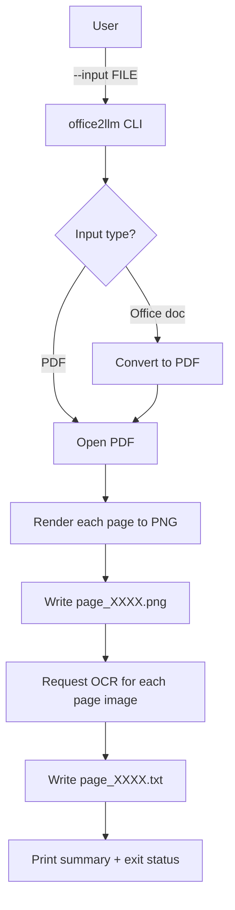
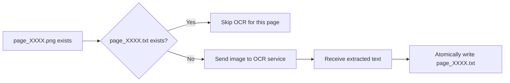
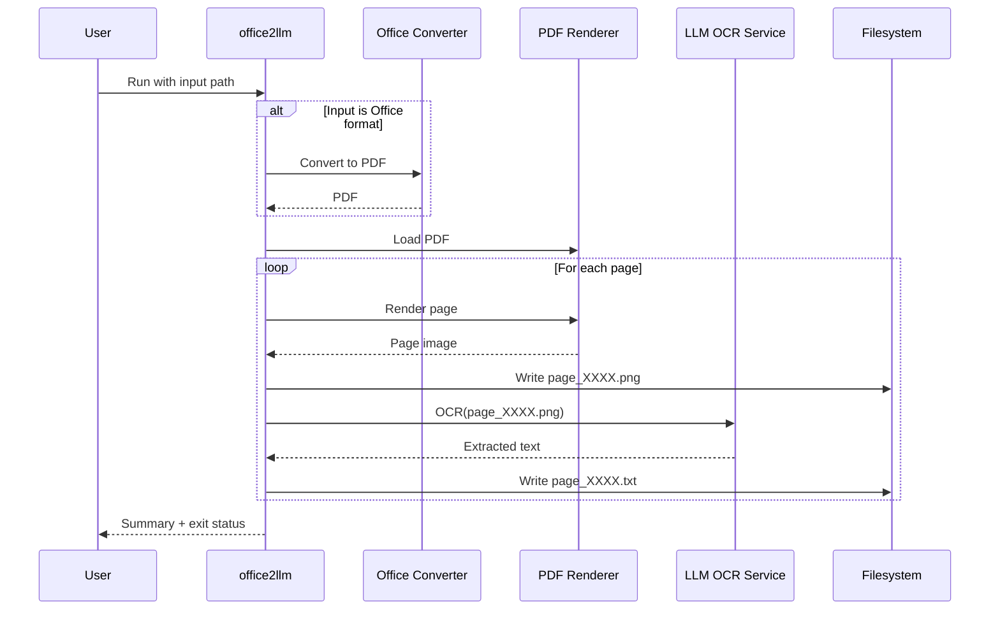

## Architecture: office2llm

### System overview
`office2llm` is a batch-oriented CLI that converts a single input document into per-page artifacts for downstream retrieval workflows:
- **Page images**: `page_XXXX.png`
- **OCR text**: `page_XXXX.txt`

It supports Office formats by converting them into a PDF first, then rendering pages to images and extracting OCR text per page via an external LLM-powered OCR service.

### Tech stack (current)
- **Language/runtime**: Python 3.10+
- **CLI**: Python entrypoint (`office2llm`)
- **Office → PDF conversion**: LibreOffice/soffice (external binary)
- **PDF rendering**: PDFium via `pypdfium2`
- **Image handling**: `Pillow`
- **OCR (LLM)**: Google GenAI SDK (`google-genai`) to an external Gemini OCR-capable model
- **Packaging**: `pyproject.toml` (setuptools)
- **Container option**: Dockerfile (optional runtime)

### High-level data flow

### Page-level processing flow

### Sequence diagram (happy path)

### Key architectural properties
- **Deterministic outputs**: stable naming (`page_XXXX.*`) enables downstream indexing and predictable diffs.
- **Resumability**: existing `page_XXXX.txt` can be treated as “already processed” to make reruns cheap and safe.
- **Batch resilience**: partial OCR failures do not prevent other pages from being processed; failures are surfaced in a final summary and exit status.
- **Bounded parallelism**: OCR is performed concurrently but with a small cap to reduce the risk of quota/rate-limit issues.
- **Atomic writes**: text outputs are written in a way that avoids leaving partially-written files on interruption.

### Runtime dependencies
- **Local execution**
  - Requires LibreOffice installed and available on `PATH` for non-PDF inputs.
  - Requires credentials for the OCR service.
- **Container execution**
  - Docker image bundles LibreOffice and Python dependencies; OCR still requires credentials at runtime.

### External interfaces
- **CLI inputs**
  - Input file path
  - Optional output directory
  - Optional rendering-quality controls
- **CLI outputs**
  - `page_XXXX.png` and `page_XXXX.txt` per page
  - A single-line summary and a process exit code indicating success/partial failure

