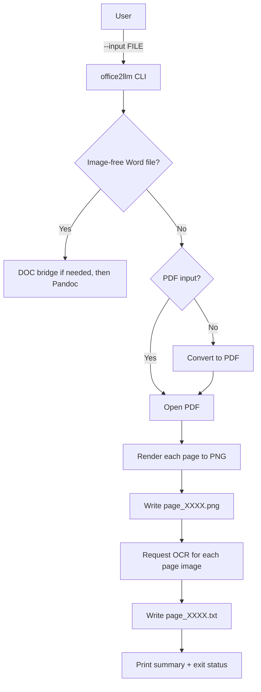
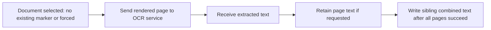
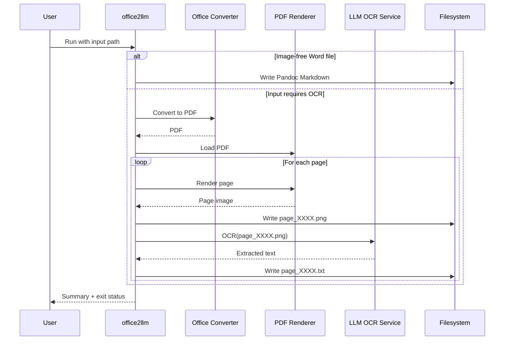

## Architecture: office2llm

### System overview
`office2llm` is a batch-oriented CLI with two deterministic document paths:
- **Native Word path**: image-free DOCX files use Pandoc; legacy DOC files use a temporary LibreOffice DOCX conversion followed by Pandoc.
- **OCR path**: Word files with any embedded image, other Office formats, PDFs, and images use per-page rendering and OCR.

The OCR path produces:
- **Combined text**: `<filename.ext>.txt` beside the input after all pages succeed
- **Page images**: `page_XXXX.png`
- **OCR text**: `page_XXXX.txt`

Page artifacts are retained in `<filename.ext>__pages__/` by default, or generated
temporarily under `--fulltext-only`. Both modes apply to individual files and batches.
Folder discovery uses an optional recursive walk with an extension allowlist and
prunes generated artifact directories. Dry runs and execution share selection and
processed-output detection. Existing text, Markdown, or matching artifact folders
skip the document before conversion; `--force-overwrite` regenerates all pages.

It supports Office formats by converting them into a PDF first, then rendering pages to images and extracting OCR text per page via an external LLM-powered OCR service.

### Tech stack (current)
- **Language/runtime**: Python 3.10+
- **CLI**: Python entrypoint (`office2llm`)
- **Office → PDF conversion**: LibreOffice/soffice (external binary)
- **Word → Markdown conversion**: LibreOffice for legacy DOC, then Pandoc
- **PDF rendering**: PDFium via `pypdfium2`
- **Image handling**: `Pillow`
- **OCR (LLM)**: Google GenAI SDK (`google-genai`) to an external Gemini OCR-capable model
- **Packaging**: `pyproject.toml` (setuptools)
- **Container option**: Dockerfile (optional runtime)

### High-level data flow

```mermaid
flowchart TD
  U[User] -->|--input FILE| CLI[office2llm CLI]
  CLI --> T{Image-free Word file?}
  T -->|Yes| M[DOC bridge if needed, then Pandoc]
  T -->|No| K{PDF input?}
  K -->|No| C[Convert to PDF]
  K -->|Yes| P[Open PDF]
  C --> P
  P --> R[Render each page to PNG]
  R --> W1[Write page_XXXX.png]
  W1 --> O[Request OCR for each page image]
  O --> W2[Write page_XXXX.txt]
  W2 --> S[Print summary + exit status]
```

### Page-level processing flow

```mermaid
flowchart LR
  A[Document selected: no existing marker or forced] --> D[Send rendered page to OCR service]
  D --> E[Receive extracted text]
  E --> F[Retain page text if requested]
  F --> G[Write sibling combined text after all pages succeed]
```

### Sequence diagram (happy path)

```mermaid
sequenceDiagram
  participant U as User
  participant CLI as office2llm
  participant LO as Office Converter
  participant PDF as PDF Renderer
  participant OCR as LLM OCR Service
  participant FS as Filesystem

  U->>CLI: Run with input path
  alt Image-free Word file
    CLI->>FS: Write Pandoc Markdown
  else Input requires OCR
    CLI->>LO: Convert to PDF
    LO-->>CLI: PDF
    CLI->>PDF: Load PDF
    loop For each page
      CLI->>PDF: Render page
      PDF-->>CLI: Page image
      CLI->>FS: Write page_XXXX.png
      CLI->>OCR: OCR(page_XXXX.png)
      OCR-->>CLI: Extracted text
      CLI->>FS: Write page_XXXX.txt
    end
  end
  CLI-->>U: Summary + exit status
```

### Key architectural properties
- **Deterministic outputs**: stable naming (`page_XXXX.*`) enables downstream indexing and predictable diffs.
- **Repeat-run safety**: existing text, Markdown, or artifact directories skip the document. Incomplete runs require explicit forced regeneration.
- **Batch resilience**: partial OCR failures do not prevent other pages from being processed; failures are surfaced in a final summary and exit status.
- **Bounded parallelism**: OCR is performed concurrently but with a small cap to reduce the risk of quota/rate-limit issues.
- **Atomic writes**: text outputs are written in a way that avoids leaving partially-written files on interruption.

### Runtime dependencies
- **Local execution**
  - Requires Pandoc for image-free Word conversion.
  - Requires LibreOffice installed and available on `PATH` for legacy DOC and non-PDF OCR inputs.
  - Requires credentials only for inputs routed to the OCR service.
- **Container execution**
  - Docker image bundles LibreOffice and Python dependencies; OCR still requires credentials at runtime.

### External interfaces
- **CLI inputs**
  - Input file or folder path, optional recursion and extension filter
  - Optional output directory
  - Optional rendering-quality controls
- **CLI outputs**
  - One Markdown file for an image-free Word document
  - One sibling combined OCR text file after every page succeeds
  - `page_XXXX.png` and `page_XXXX.txt` per page
  - A single-line summary and a process exit code indicating success/partial failure
